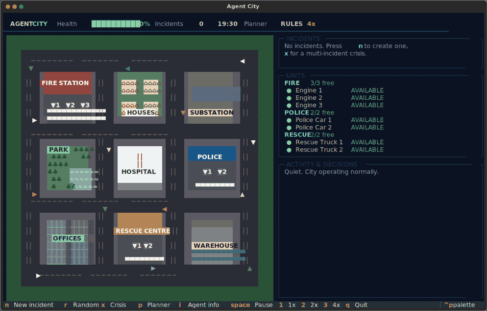
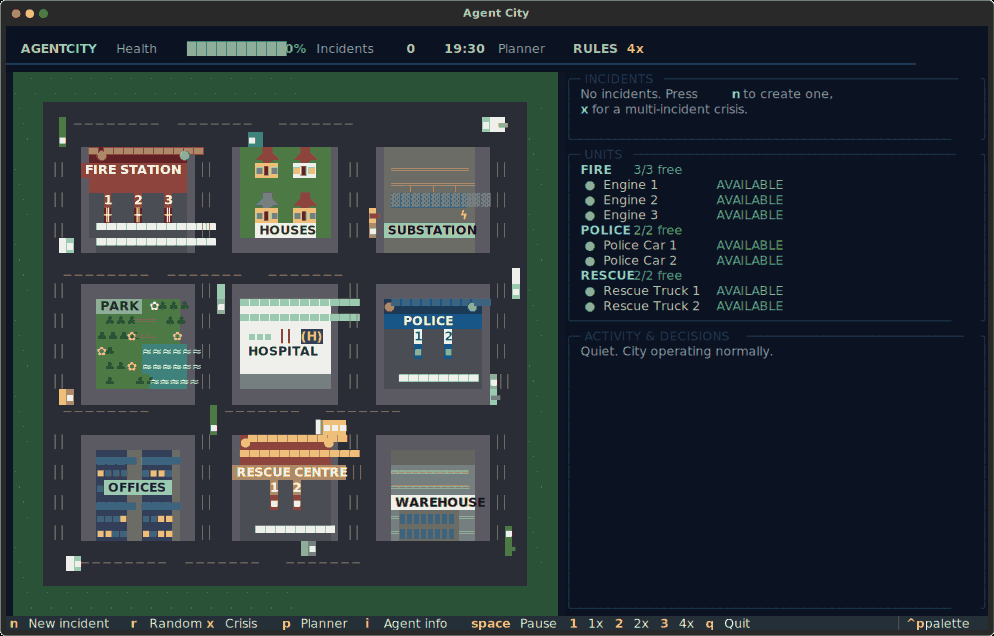
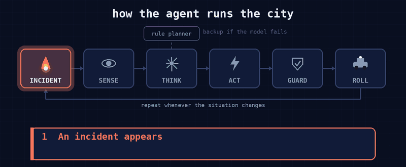

<div align="center">


**A miniature city run by an AI agent, live in your terminal.**
You create the emergencies. A [Strands](https://strandsagents.com) agent decides who to send.



[](https://www.python.org)
[](https://textual.textualize.io)
[](https://strandsagents.com)
[](https://ollama.com)
[](https://docs.astral.sh/uv/)

</div>

## Why Agent City?

Most agent demos are chat. This one is a **control problem**: limited resources, competing demands, a clock that keeps
running. There are 7 emergency units for 6 sites, HIGH severity incidents need two units each, and anything
unattended escalates. The agent has to prioritise, and you can watch every decision, with its reasons, as it makes it.

- **Sandbox for agent behaviour.** Swap the model, edit the system prompt, or add a tool and see what changes.
- **A baseline to beat.** A deterministic `RulePlanner` solves the same problem, so you can compare the agent against it.
- **Nothing hidden.** The Agent Info screen shows what the agent sees, its tools, guardrails and recent tool calls.
- **Safe by construction.** The simulation exposes tools (`dispatch_*`); the agent cannot exceed `units_still_needed`.

<div align="center">

</div>

## What if an AI ran your city's emergency desk?

Picture a dispatcher who never sleeps, never panics, and has to decide **right now**: a substation is on fire, a
flood is rising at the park, and someone is robbing the warehouse. There are only 7 units, and two of those
incidents need two of them. Who goes where?

In Agent City that dispatcher is an LLM agent. You are the chaos.

<div align="center">

</div>

**How it identifies.** Nothing is hard-wired to an incident. Each time the situation changes, the agent is handed a
fresh snapshot of the city: every open incident (what it is, where, how severe, how long it has waited, how many
units it still needs) and every unit (free or deployed, and to what). It reads this the way a human dispatcher reads
a screen.

**How it decides.** Its instructions tell it to rank the incidents: higher severity first, then
fire > flood > theft, then whoever has waited longest. It then serves them in that order and never promises more
units than an incident needs. Unattended incidents escalate after about 45 s, so a bad call costs city health.

**How it dispatches.** The agent does not move anything itself. It calls tools, mostly a single
`dispatch_plan` with every order in priority order and a short reason for each. A guarded dispatcher validates the
orders (right kind of unit, no over-assignment) and the units then drive the real road network to the scene.

What you see in the activity feed looks like this (illustrative):

```
> To model     3 incidents, 7 units free
< Model ordered  1. Substation fire (HIGH)   -> Engine 1, Engine 2   "highest severity, spreads fastest"
                 2. Park flood   (MEDIUM) -> Rescue Truck 1       "second rank, one unit is enough"
                 3. Warehouse theft (LOW) -> Police Car 1           "lowest rank, but units are free"
```

Because it is a closed loop, you can poke it: send a **crisis** (`x`) to create more demand than units, switch to
the **rule planner** (`p`) to compare, or open **Agent Info** (`i`) to inspect exactly what the model sees and calls.

## Get started

```bash
git clone https://github.com/rahrajlat/agent-controlled-city.git
cd agent-controlled-city
uv sync

cd src/agent_city
uv run python main.py            # Strands agent in charge (needs Ollama)
uv run python main.py --rules    # deterministic rule planner, no LLM needed
```

Use a terminal of about **130x40** or larger.

| Flag | Meaning |
| --- | --- |
| `--rules` | Use the deterministic rule planner instead of the agent |
| `--model NAME` | Any Ollama model (default `gpt-oss:120b-cloud`, or set `AGENT_CITY_MODEL`) |

The agent needs Ollama running (`ollama signin` for the cloud model). If it is not reachable, the app falls back
to the rule planner and says so in the activity feed.

## Features

- Live top-down ASCII city: roads, buildings, vehicles with lights, flames and smoke, flood water, theft alarms, crews on foot
- Three incident types (fire, theft, flood) at six sites and three severities, with escalation and a city-health score
- A\* routing, kerb parking, U-turns and reversing into bays, plus background traffic that stops for cars ahead
- A persistent Strands agent with tool calls, run in a background thread so the city never freezes
- Automatic fallback to the rule planner if the model fails or does not act
- Pause and 1x / 2x / 4x speed, a crisis mode (five incidents at once), and an incident wizard

## Controls

| Key | Action |
| --- | --- |
| `n` | New incident wizard: what (fire / theft / flood), where (6 sites), how severe (high / medium / low) |
| `r` | Random incident |
| `x` | Crisis: five incidents at once - more demand than units, so priorities matter |
| `p` | Switch planner between the Strands agent and the rule planner |
| `i` | **Agent info**: model, status, calls, what it sees, its tools (with arguments), guardrails, recent tool calls, its instructions |
| `space`, `1` `2` `3` | Pause, speed 1x / 2x / 4x |
| `q` | Quit |

| Incident | Answered by | Units |
| --- | --- | --- |
| Fire | Fire station | 3 engines |
| Theft | Police station | 2 patrol cars |
| Flood (natural calamity) | Rescue centre | 2 rescue trucks |

HIGH severity needs **2 units**, MEDIUM and LOW need 1. Units stay busy until they are back in their bay, so with
several incidents the planner has to choose. Incidents nobody attends **escalate** one level after ~45 s and city
health drops while they burn / flood / are robbed.

## How the decision is made

The agent is a persistent Strands `Agent` (`simulation/agent_planner.py`) on an Ollama model. Whenever the
situation changes (new incident, a unit comes home) it is given the city state and calls tools:

| Tool | Effect |
| --- | --- |
| `dispatch_plan(orders)` | one call with every order in priority order: `{incident_id, units, reason}` |
| `dispatch_fire_team` / `dispatch_police` / `dispatch_rescue_team` | send one unit to one incident |
| `get_city_state` | fresh snapshot: incidents (needed / assigned), free and deployed units, missions |

Its system prompt tells it to rank incidents (severity, then fire > flood > theft, then waiting time), serve in strict
rank order, never exceed `units_still_needed`, and explain each dispatch in `reason`. The activity feed shows each
exchange: **▶ To model** (the state it was sent), **◀ Model ordered** (its tool call with reasons and outcome) and
**◀ Model said**. Entries about an incident disappear from the feed once that incident is resolved. The LLM call runs in a background thread so the city keeps moving; the top bar
shows `Planner AGENT thinking…`. If the model fails repeatedly, or does not act on a situation, the rule planner
steps in so the city is never left unattended.

`simulation/planner.py::RulePlanner` is the deterministic baseline (same priority idea, greedy over free units), handy
to compare against.

## Architecture

```
main.py                  starts the Textual app (--rules, --model)

simulation/              pure Python - no UI imports
    city.py              City: roads, buildings, depots, vehicles; per-tick update; incidents, escalation; snapshot()
    incidents.py         Incident types (FIRE / THEFT / FLOOD), severity, units needed, work time
    missions.py          Mission state machine CREATED .. COMPLETE (one unit -> one incident)
    dispatcher.py        the actuator: dispatch_* tools used by every planner
    planner.py           Planner base + RulePlanner (priority score)
    agent_planner.py     StrandsPlanner: Strands agent + tools (runs the LLM in a background thread)
    road_network.py      RoadGraph + A* routes          resources.py   reserve()/release()
    world_state.py       clock, city health, incidents, missions, activity log
    choreography.py      where each crew member is during a mission

entities/                data + kinematics: vehicle.py, depot.py (bays + doors), fire/police/rescue depots, buildings, teams

scenarios/demo.py        random_incident(), crisis()

tui/                     Textual front end (observes the simulation)
    map_view.py          top-down ASCII city: roads, buildings, vehicles, flames/smoke, flood water, theft alarms, crews
    app.py               header, incident wizard, incidents / units / activity panels, key bindings
    agent_info.py        the Agent Info screen (reads the live tool specs, stats and tool-call log)
```

### Roads and vehicle movement

`RoadGraph.grid()` builds a 4x4 grid of road nodes plus a node halfway along every block edge (each building's access
point); `calculate_route()` is A*. `City.plan_departure()/plan_return()` turn a route into vehicle waypoints: bay exit ->
roads -> kerb parking (a second unit stops just past the first), or U-turn -> roads -> swing past the bay -> reverse in.
`Vehicle.update()` steers toward the next waypoint with a limited turn rate, slows for corners and stops, and supports
reverse waypoints. Background traffic wanders the graph and stops for a car ahead.

### Mission states and what you see

| status | what you see |
| --- | --- |
| DISPATCHED | bay door opens, crew runs to the vehicle |
| EN_ROUTE | lights flash, vehicle follows its route |
| ARRIVED | parked at the kerb, crew walks to the site |
| RESPONDING | water arcs (fire, flood) / officers on scene; the incident shrinks, faster with 2 units |
| RESOLVED | incident cleared, crew walks back |
| RETURNING -> COMPLETE | vehicle returns, reverses into its bay; unit is AVAILABLE again |

## Development

```bash
uv sync                              # runtime + dev dependencies
uv run python scripts/make_gifs.py   # regenerate the demo GIFs in docs/assets/
uv run python scripts/make_logo.py   # regenerate the logo
uv run python scripts/make_flow.py   # regenerate the flow diagram
```

`scripts/make_gifs.py` drives the real Textual app headlessly with the rule planner and a fake clock, so the
animations are reproducible and need no LLM. Frames are rendered from Textual's SVG screenshots with `cairosvg`
and assembled with Pillow.
